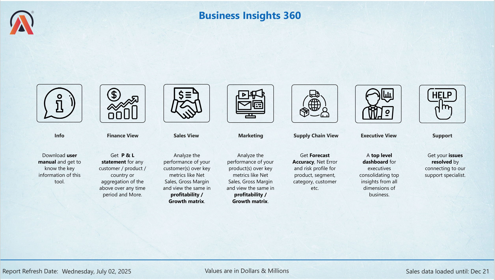
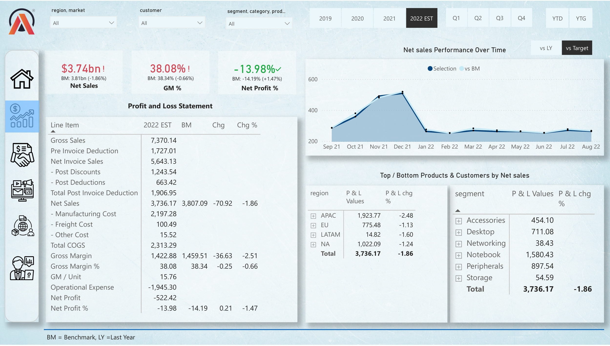
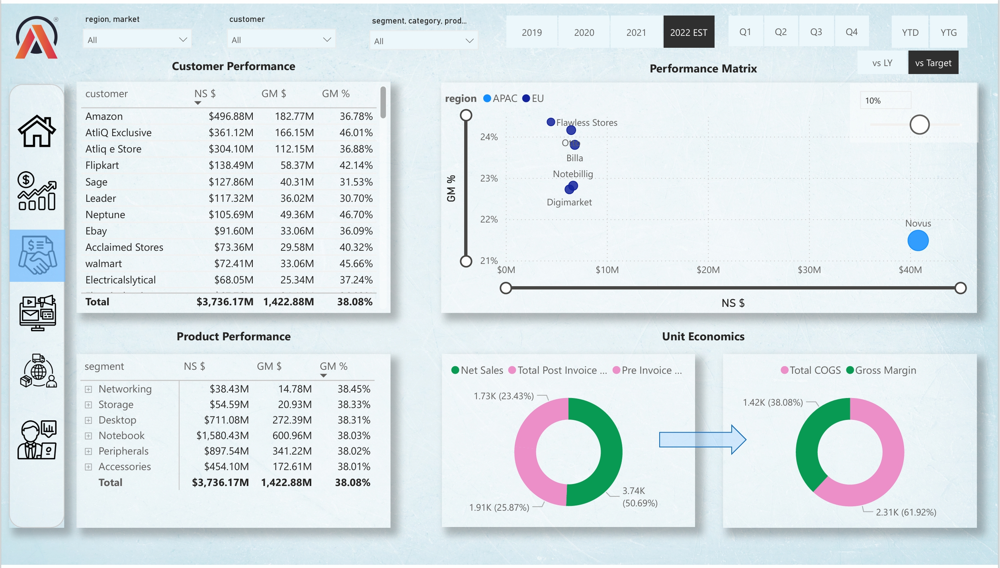
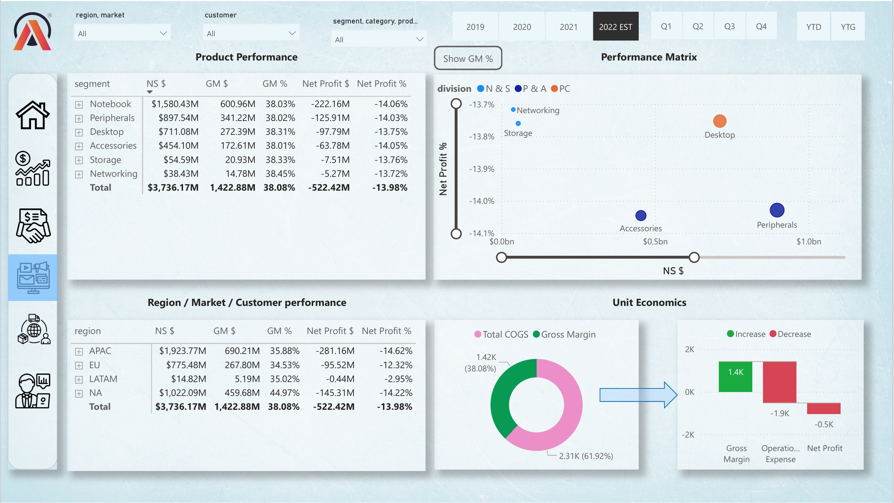
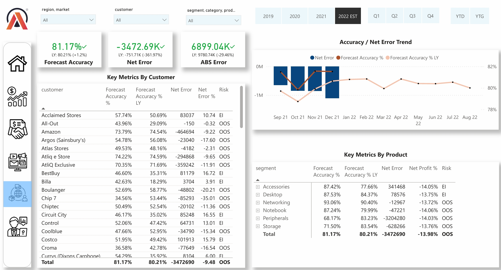
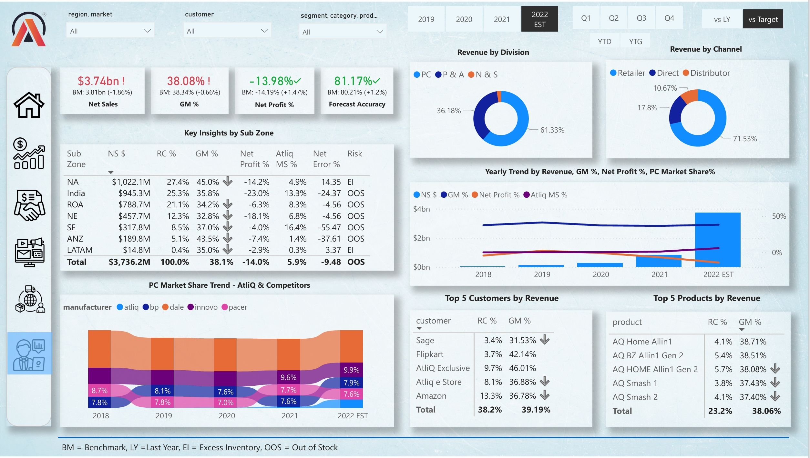

# 📊 Business Insights 360 - Power BI Project

## 🚀 Project Overview
Business Insights 360 is a comprehensive Power BI dashboard for AtliQ Hardware, a global company in the computers and accessories sector. It provides a 360-degree view of Finance, Sales, Marketing, Supply Chain, and Executive metrics, enabling data-driven decisions and strategic growth[1].

## 🔗 Live Dashboard
Due to the Power BI report `.pbix` file size exceeding GitHub upload limits, please use the live, interactive report here:
[Business Insights 360 – Power BI Report](https://app.powerbi.com/view?r=eyJrIjoiNDY3ZGQ1OWYtNTNlNi00YWEwLTk1N2QtNjk3YjliMjM3MWI0IiwidCI6ImM2ZTU0OWIzLTVmNDUtNDAzMi1hYWU5LWQ0MjQ0ZGM1YjJjNCJ9)[1].

## 📸 Screenshots
Key dashboard views and insights are captured below. For full interaction, please visit the live dashboard link above[1].

  
*Navigation hub with buttons to access all report pages*[1].

  
*Profit & Loss overview, sales trends, and margin insights*[1].

  
*Customer and product performance with dynamic filters*[1].

  
*Campaign and segment profitability*[1].

  
*Forecast accuracy and inventory risk metrics*[1].

  
*High-level KPIs and consolidated executive insights*[1].

## 📂 Dataset Summary
The report uses data from MySQL databases and Excel/CSV sources, including customer, product, market dimensions, sales and forecast facts, and cost-related data like manufacturing and freight[1].

## 🛠 Data Modeling
- Snowflake schema implementation for efficient querying and relationship management[1].
- Robust data model is the foundation for all visuals and performance[1].

## 💻 Technologies Used
- Power BI Desktop, DAX, MySQL, Excel, DAX Studio[1].

## 📖 How to Use
- Open screenshots for visual reference, and use the live dashboard link for interaction[1].
- Review accompanying scripts or sample data if included in this repository[1].

## 🎓 Skills Gained
- Power BI design, modeling, DAX, multi-source integration, navigation, and performance tuning[1].

## 🤝 Contact & Contributions
Contributions and suggestions are welcome. Please open issues or pull requests[1].

---
> Transforming data into actionable business insights. 📊[1]
