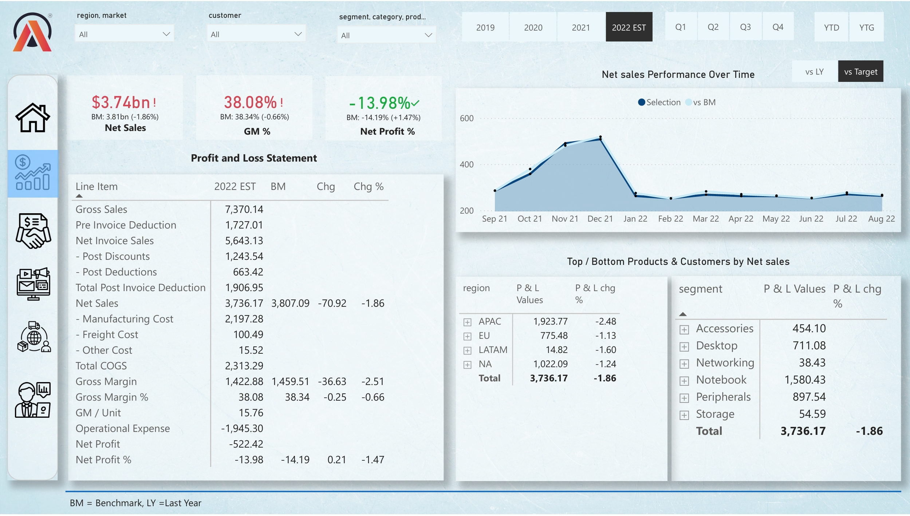
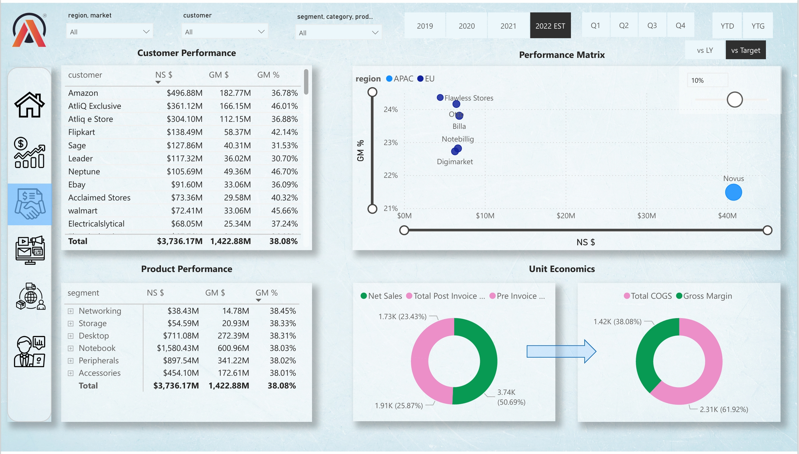
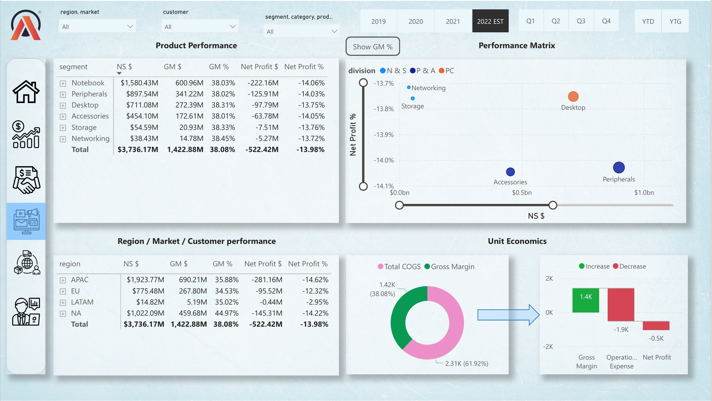
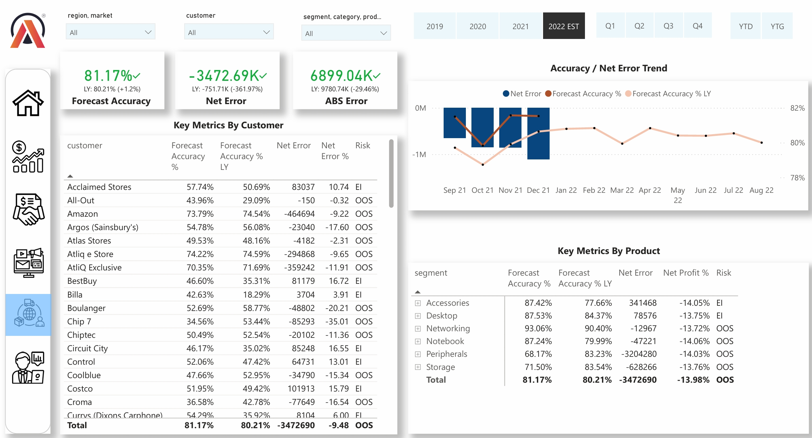
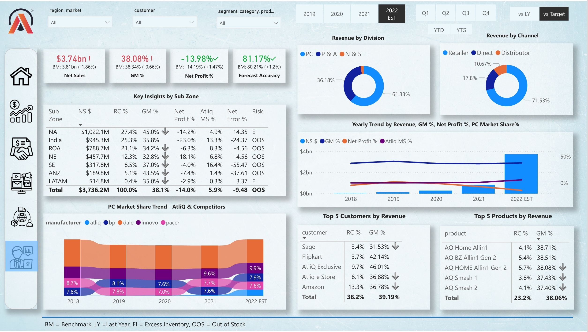

# 📊 Business Insights 360 - Power BI Project

## 🚀 Project Overview
Business Insights 360 is a comprehensive Power BI dashboard for AtliQ Hardware, a global company in the computers and accessories sector. It provides a 360-degree view of Finance, Sales, Marketing, Supply Chain, and Executive metrics, enabling data-driven decisions and strategic growth.

## 🔗 Live Dashboard Access
Due to the Power BI report `.pbix` file size being over GitHub’s upload limits, the interactive dashboard is available online:

## 🔗 Live Dashboard
[Business Insights 360 – Power BI Report](https://app.powerbi.com/view?r=eyJrIjoiNDY3ZGQ1OWYtNTNlNi00YWEwLTk1N2QtNjk3YjliMjM3MWI0IiwidCI6ImM2ZTU0OWIzLTVmNDUtNDAzMi1hYWU5LWQ0MjQ0ZGM1YjJjNCJ9)

## 📸 Screenshots
Key dashboard views and insights are captured below. For full interaction, please visit the live dashboard link above.

 
*Navigation hub with buttons to access all report pages.*

   
*Profit & Loss overview, sales trends, and margin insights.*

  
*Customer and product performance with dynamic filters.*

   
*Campaign and segment profitability.*

  
*Forecast accuracy and inventory risk metrics.*

   
*High-level KPIs and consolidated executive insights.*

## 📂 Dataset Summary
The report uses data from MySQL databases and Excel/CSV sources, including customer, product, market dimensions, sales and forecast facts, and cost-related data like manufacturing and freight.

## 🛠 Data Modeling
- Snowflake schema implementation for efficient querying and relationship management.
- Robust data model is the foundation for all visuals and performance.

## 💻 Technologies Used
- Power BI Desktop
- DAX for calculations and measures
- MySQL for data querying
- Excel for preprocessing and exports
- DAX Studio for report optimization

## 📖 How to Use
- Clone or download this repo.
- Open screenshots for visual reference.
- Use the live dashboard link for full interactive exploration.
- Review accompanying scripts or sample data (if included).

## 🎓 Skills Gained
- Advanced Power BI dashboard design, modeling, and DAX.
- Data integration from multiple sources.
- Interactive report navigation and storytelling.
- Performance tuning using DAX Studio.

## 🤝 Contact & Contributions
Contributions and suggestions are welcome! Feel free to open issues or pull requests.

---

> Transforming data into actionable business insights. 📊
